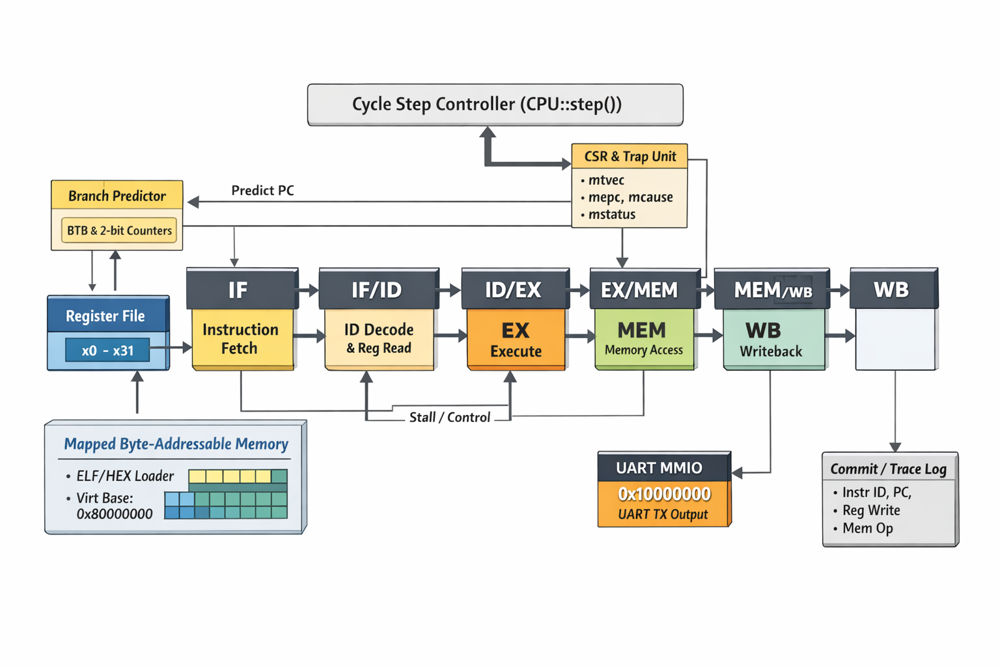
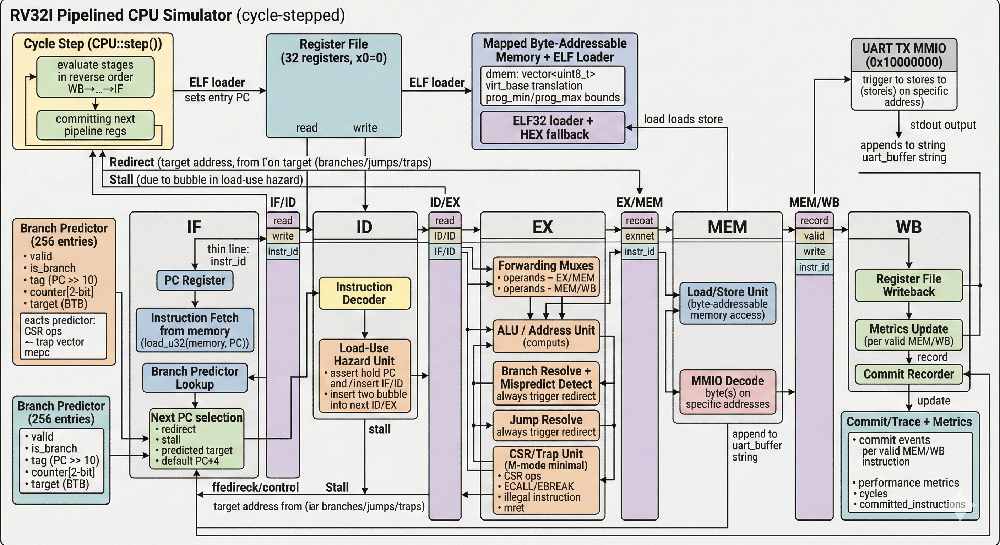

<div align="center">

# RV32 Pipeline Simulator

An educational, cycle-stepped RISC-V RV32I simulator with a five-stage pipeline and three frontends: browser, native CLI, and native GUI.

`IF → ID → EX → MEM → WB`


</div>

<p align="center">
  
</p>

> The diagrams are conceptual project illustrations, not formal RTL or a signal-accurate hardware specification.

## What it models

| Area | Implementation |
|---|---|
| Pipeline | Five-stage, in-order `IF/ID/EX/MEM/WB` execution |
| Hazards | Load-use interlocks plus EX/MEM and MEM/WB forwarding |
| Control flow | Branch and jump redirects with misprediction recovery |
| Prediction | 256-entry tagged BTB with two-bit saturating counters |
| ISA | RV32I integer instructions plus a small machine-mode CSR/trap subset |
| Memory | Unified, byte-addressable little-endian memory; unaligned accesses are allowed |
| I/O | Memory-mapped UART transmit at `0x10000000` |
| Verification | Native CLI compares every committed instruction against a sequential reference model |

The included examples keep writable data at `0x00000100` or above so it does not overwrite the program image in unified memory.

<details>
<summary><strong>Open the detailed implementation diagram</strong></summary>

<br>

<p align="center">
  
</p>

</details>

## Frontends

- **Web simulator:** a single-page interface backed by WebAssembly, with pipeline, disassembly, register, memory, UART, and metrics panels.
- **Native CLI:** batch execution, pipeline tracing, a terminal dashboard, and a GDB-like interactive debugger.
- **Native GUI:** an ImGui/ImPlot desktop interface with live pipeline and performance views.

## Quick start

### Native CLI and GUI

Requirements:

- CMake 3.15 or newer
- A C++17 compiler
- For the GUI, an OpenGL driver and the platform development libraries required by GLFW

Linux, macOS, or a single-config generator:

```bash
cmake -S . -B build -DCMAKE_BUILD_TYPE=Release
cmake --build build --parallel
./build/rv32-sim programs/test.hex
```

Visual Studio on Windows:

```powershell
cmake -S . -B build
cmake --build build --config Release --parallel
.\build\Release\rv32-sim.exe .\programs\test.hex
```

Launch `rv32-gui` from the same output directory to use the desktop interface. To build only the portable core and CLI—for example on CI or a machine without GUI development packages—configure with:

```bash
cmake -S . -B build -DCPU_SIM_BUILD_GUI=OFF -DCMAKE_BUILD_TYPE=Release
```

### Run the verification suite

```bash
cmake -S . -B build -DCPU_SIM_BUILD_GUI=OFF -DBUILD_TESTING=ON -DCMAKE_BUILD_TYPE=Release
cmake --build build --config Release --parallel
ctest --test-dir build -C Release --output-on-failure
```

The six CTest cases run the bundled programs through per-commit cosimulation and fail if registers or memory diverge from the reference model.

### CLI modes

```text
rv32-sim [--trace] [--gdb] [--ui] program.(hex|elf) [max_cycles]
```

- `--trace` prints the pipeline every cycle.
- `--gdb` opens the interactive debugger with stepping, breakpoints, registers, and memory examination.
- `--ui` opens the terminal dashboard.
- `max_cycles` defaults to `100000`.

## Web simulator

Requirements:

- Emscripten SDK 3.1.60 or newer, activated in the current shell
- CMake 3.15 or newer
- Python 3 for the local HTTP server

Linux or macOS:

```bash
./web/build_wasm.sh
```

Windows PowerShell:

```powershell
.\web\build_wasm.ps1
```

Each script performs a release build, generates the self-contained `web/sim.js` module, and serves `web/` at `http://localhost:8000`.

Manual build:

```bash
emcmake cmake -S . -B build-wasm -DCMAKE_BUILD_TYPE=Release
cmake --build build-wasm --parallel
cd web
python3 -m http.server 8000
```

### GitHub Pages

The included `.github/workflows/pages.yml` workflow builds the WebAssembly module and deploys `web/` after a push to `main`. After creating the repository, enable **Settings → Pages → Source → GitHub Actions**. Add a public demo link here only after the first deployment succeeds.

### Web keyboard shortcuts

| Shortcut | Action |
|---|---|
| `Alt+Space` | Run or pause |
| `Alt+S` | Step one pipeline cycle |
| `Alt+C` | Step to the next committed instruction |
| `Alt+R` | Reset the CPU and restore the loaded program image |
| `Alt+L` | Load a local program |
| `Alt+E` | Open the example picker |
| `Esc` | Exit a maximized panel |

## Bundled programs

| Program | Demonstrates | Result |
|---|---|---|
| Array Sum | Store/load loops and integer arithmetic | Sum `1..100` in `x10` |
| Fibonacci | Loop-carried dependencies | 20 words beginning at `0x100` |
| Factorial | Multiplication by repeated addition | `10!` at `0x100` |
| Bubble Sort | Loads, stores, comparisons, and branches | Sorted eight-word array at `0x100` |
| Load-Use Hazards | Four intentional load-use dependencies | Four recorded stall cycles |
| Branch Prediction | Predictor warm-up and loop exit | Two mispredictions from weak-not-taken initialization |

## Program formats

### Hex

Hex files contain one 32-bit instruction word per line, written as eight hexadecimal digits. The loader places each word into little-endian memory. Blank lines and comments beginning with `#` or `//` are ignored.

```text
00000013  # nop
00500113  # addi x2, x0, 5
```

Run `python web/examples/encode.py` to regenerate the five generated examples. The script writes beside itself, regardless of the current working directory.

### ELF

The loader accepts little-endian ELF32 files with `PT_LOAD` segments and uses the ELF entry point. Symbol extraction is best-effort; this is not a dynamic linker and does not process relocations.

## Supported instructions and limits

Implemented RV32I groups include:

- Integer register operations: `ADD`, `SUB`, shifts, comparisons, and bitwise operations
- Immediate arithmetic and logical operations
- Byte, halfword, and word loads/stores, signed and unsigned where defined by RV32I
- Conditional branches, `JAL`, `JALR`, `LUI`, and `AUIPC`
- `ECALL`, `EBREAK`, `MRET`, and the six CSR read/modify/write forms

Minimal machine-mode state includes `mstatus`, `mtvec`, `mepc`, and `mcause`.

This is an educational simulator, not a complete RISC-V platform or compliance target. It does not model the M/A/F/D/C extensions, virtual memory, caches, interrupts, multiple privilege modes, peripherals beyond UART TX, or physical timing. Memory accesses are intentionally permissive and allow unaligned addresses.

## Project layout

```text
.
├── include/cpu/          # Core data structures and public headers
├── src/                  # Pipeline, decoder, memory, CLI, GUI, and WASM API
├── programs/             # Native CLI example input
├── web/                  # Browser UI, build scripts, and example programs
├── images/               # README architecture illustrations
├── external/             # Vendored GLFW, Dear ImGui, and ImPlot
├── .github/workflows/    # Native CI and GitHub Pages deployment
└── CMakeLists.txt
```

## Third-party software and license

Project code is provided under the [MIT License](LICENSE). Vendored GLFW, Dear ImGui, and ImPlot retain their upstream licenses; versions and source links are recorded in [THIRD_PARTY_NOTICES.md](THIRD_PARTY_NOTICES.md).
